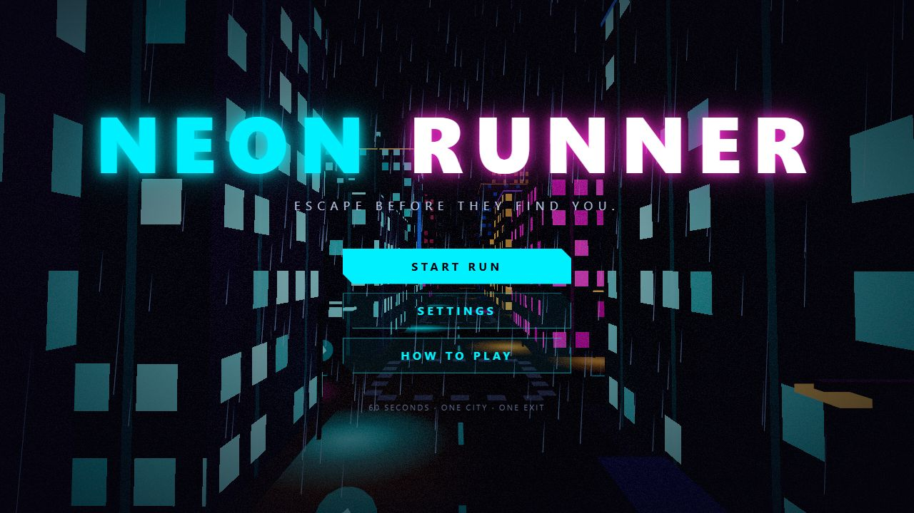
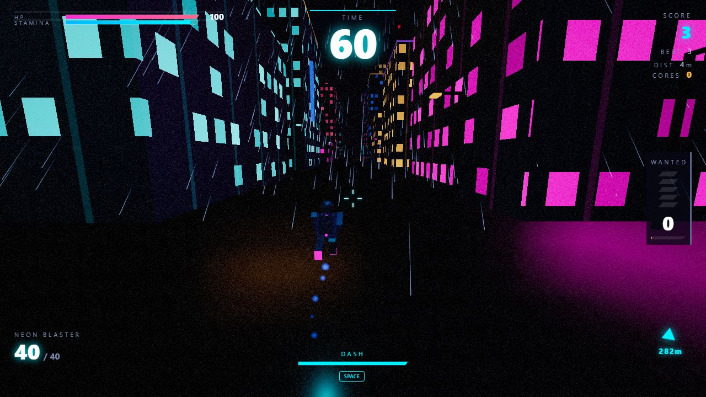
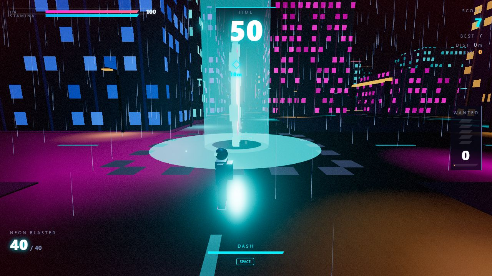
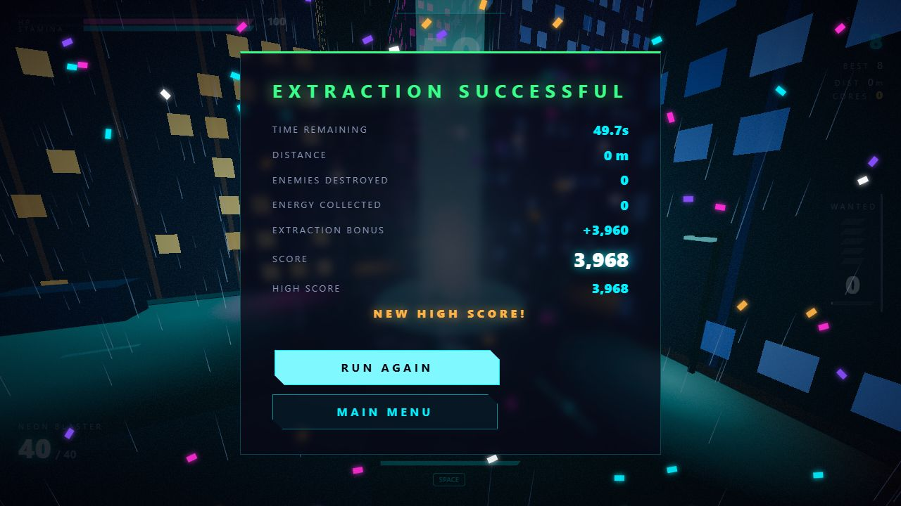
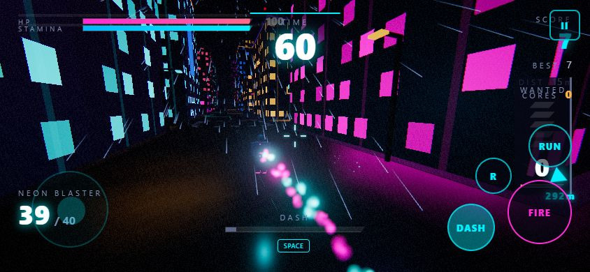

# NEON RUNNER

**A 3D cyberpunk survival runner that runs entirely in your browser.**
You have **60 seconds** to fight through a rain-soaked neon city and reach the extraction portal, while security drones hunt you and your wanted level keeps climbing.

## ▶ Play now

### **https://neorunner.web.app**

Desktop browser recommended (Chrome, Edge or Firefox with WebGL). Use headphones if you can: the sound and music are part of the experience. Nothing to install, no sign-up.



| Gameplay | Extraction portal |
| --- | --- |
|  |  |

| Victory | Mobile (touch controls) |
| --- | --- |
|  |  |

---

## The goal

Reach the glowing **extraction portal** before the timer hits zero. A marker on screen shows its direction and distance, and it is visible from across the city.

On the way you can collect energy cores, destroy drones for score, and chain combos. But everything you do raises your **wanted level**, and the higher it climbs, the more (and tougher) drones come for you. Die or run out of time and the mission fails. Press a button and you're running again in seconds.

## Controls

| Action | Keyboard & mouse | Touch |
| --- | --- | --- |
| Move | `W` `A` `S` `D` | Left stick |
| Look | Mouse | Drag on the right side |
| Sprint | `Shift` (hold) | RUN button |
| Dash | `Space` | DASH button |
| Fire | Left click (hold to auto-fire) | FIRE button |
| Reload | `R` | R button |
| Pause | `Esc` | Pause button |

Touch controls appear automatically on touch devices.

## How the game works

### Movement
- **Sprint** moves you from 11 to 17 m/s but drains stamina (about 4 seconds of full sprint). Run dry and you must recover some stamina before sprinting again.
- **Dash** blasts you 10 m in the direction you're steering, with brief invulnerability to shots. Cooldown is 2 seconds.

### The Neon Blaster
Hitscan energy weapon: 25 damage per shot, 40 energy cells per magazine, 1.3 second reload (it reloads automatically when empty). Shots go through the crosshair, so aim where you want to hit.

### Drones
| Drone | Health | Behaviour |
| --- | --- | --- |
| **Scout** | 40 | Fast and weak. Single quick shots. |
| **Combat** | 100 | Medium speed. Fires 3-shot bursts. |
| **Heavy** | 300 | Slow and tough. Slow, powerful bolts. |

Drones detect you, chase, hold a preferred distance, circle-strafe and fire. Every attack is telegraphed by a charging glow, so shots can be read and dodged. A dash through a bolt makes you invulnerable to it.

### Wanted level (0 to 5)
Your wanted level rises over time and with every kill, core and restricted zone you enter.

| Level | What comes for you |
| --- | --- |
| 0 | Almost nothing |
| 1 – 2 | Scouts, more of them each level |
| 3 | Combat drones join |
| 4 | Heavy drones appear |
| 5 | Elite pursuit: the biggest, fastest swarms |

On top of that, the **clock adds pressure**: more drones at 45 seconds left, combat drones at 30, heavies at 15, and an extreme final push in the last 10 seconds.

### Risk and reward
- **Energy cores** float along the streets (100 points each). Rich amber cores (250) are further away.
- **Restricted zones** are red-ringed intersections. They hold the richest cores, but standing inside makes your wanted level skyrocket.
- **Health packs** are scattered around the city, and drones sometimes drop one when destroyed.

### Scoring
| Action | Points |
| --- | --- |
| Surviving | 10 per second |
| Energy core | 100 / 250 (rich) |
| Scout / Combat / Heavy drone | 150 / 300 / 750 |
| Extraction | 2,000 + 40 per second left on the clock |

Chain kills and cores quickly to build a **combo multiplier from x1 up to x5**. Getting hit breaks the combo.

---

## Features

- **Procedural city:** a seeded 20×20 block cyberpunk city with towers, setbacks, neon signs, holographic billboards, street lights, containers and restricted zones. Same seed, same city.
- **Atmosphere:** GPU-driven rain, fog that turns red as danger rises, wet reflective roads, bloom, vignette, film grain and chromatic aberration on dash and damage.
- **Polished feel:** smooth third-person camera with lag, speed-based field of view, banking, collision and screen shake. Muzzle flashes, tracers, hit sparks, explosions, damage numbers and a slow-motion escape cinematic.
- **Procedural audio:** every sound effect and the music are synthesised in the browser. The music gets more intense as your wanted level rises, and the timer warns you with beeps, alarms and a red screen edge in the last 10 seconds.
- **Settings:** master / music / SFX volume, graphics quality (low / medium / high), mouse sensitivity, screen shake and post-processing toggles. Saved in your browser.
- **High score:** stored locally in your browser (LocalStorage).
- **Built to be fast:** instanced geometry, object pooling for particles, drones and projectiles, frustum and distance culling, and only one real-time light on the player. No memory growth across restarts in testing.

## Tech stack

- [Three.js](https://threejs.org/) (WebGL) with custom shaders
- [Vite](https://vite.dev/), vanilla JavaScript (ES modules)
- Web Audio API (synthesised sound and music)
- Firebase Hosting
- No backend, no external art or audio assets

## Run it locally

Requires Node.js 20.19 or newer (22.12+ also works), as required by Vite 8.

```bash
npm install
npm run dev        # http://localhost:5173
```

Other scripts:

```bash
npm run build      # production build into dist/
npm run preview    # serve the production build locally
npm run lint       # oxlint
npm run deploy     # build + deploy to Firebase Hosting (requires firebase login)
```

### URL options
- `?seed=1234` generates a different, reproducible city.
- `?touch=1` forces the touch controls on (useful for testing on desktop).
- Press `F3` in-game for the FPS / draw calls / triangles / enemies overlay. With it open, `F4` damages you so you can test the damage feedback.

## Deploying to Firebase

1. `npm install -g firebase-tools`, then `firebase login`.
2. `firebase use <your-project-id>` to link this folder to your Firebase project.
3. `npm run deploy`.

`firebase.json` serves the `dist/` folder and caches the hashed asset files, while keeping `index.html` uncached so updates appear immediately.

## Project structure

```
src/
  main.js                 entry point
  core/                   Game loop, state machine, input, touch input, audio + music engine, assets, save
  player/                 Player, controller, camera, weapon, health
  enemies/                Drone, drone AI, projectiles, enemy manager
  world/                  City generator, buildings, roads, collision, environment, portal, restricted zones
  pickups/                Energy cores and health packs
  effects/                Particles, effects manager, rain, post-processing
  systems/                Timer, score + combo, wanted level, spawning
  ui/                     HUD, menus, settings, pause, game over, victory, damage numbers
  utils/                  Constants.js (all balancing values), math helpers, seeded random
```

### Tuning the game
All gameplay numbers live in [`src/utils/Constants.js`](src/utils/Constants.js): player speed, dash distance and cooldown, weapon damage, drone stats, wanted-level thresholds and spawn tables, time pressure, scoring, combo rules, pickup values, portal distance and graphics quality presets.

## Notes

- Browsers only allow audio and mouse capture after you interact with the page, so click **START RUN** to begin.
- If the game feels slow, set **Graphics Quality** to Low or turn off **Post-Processing** in Settings.
- The game stores your high score and settings only in your own browser. There is no shared leaderboard.
